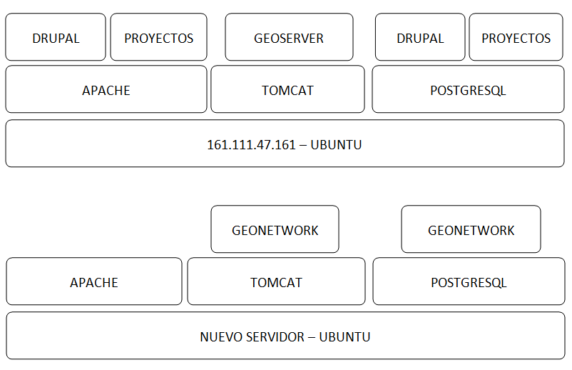

PUNTOS COMUNES
==============
Ambos proyectos comparten una serie de requisitos, tareas y una misma filosofía de trabajo:

REPARTO DE TAREAS
-----------------

USIG
****
-	Infraestructura tecnológica de ambas cosas.
-	Imago Orbis completo: gestión, mantenimiento y contenido.
-	Catálogo de Exea.
- Administración de Exea: generación de la página y de formularios necesarios.
-	Tutoriales de nuestras herramientas.
-	Talleres de Información Geográfica.
-	Carga de contenido en Exea relacionado con nuestros proyectos

Investigadores (comisión)
*************************
-	Dinamización de las Humanidades Digitales y Ciencias Sociales.
-	Carga de contenido en Exea de: proyectos, herramientas, actividades.
-	Metadatado (Dublin Core) de los recursos generados.
-	Fomentar un marco de trabajo de datos abiertos.

CREACIÓN DE UNA NUEVA HERRAMIENTA DIGITAL
-----------------------------------------
El desarrollo de nuevas herramientas o servicios útiles para las HD irá sumando partes a la estructura general de Exea / Imago Orbis, siguiendo un esquema similar al del ejemplo de los Corpora Textuales que se muestra en el diagrama:

.. image:: ../images/exea.png

ARQUITECTURA INFORMÁTICA USIG NECESARIA
---------------------------------------
**OPCIÓN 1: servidores estáticos**

**OPCIÓN 2: hosting escalable**

.. image:: ../images/hostingEscalable.png

DESARROLLO COLABORATIVO
-----------------------
El desarrollo de software necesario para la generación de ambas estructuras se realizará en abierto, a través de la plataforma **GITHUB**, espacio de trabajo común (repositorio). GitHub es un servidor Git de uso público y gratuito, en el que se desarrollan de forma colaborativa proyectos de software libre.
Planteamos una adaptación a este entorno de trabajo en dos sentidos:
-	Creación y mantenimiento de los desarrollos y configuraciones personalizadas de Geonetwork (y potencialmente Exea, si es que se realiza algún desarrollo propio)
-	Creación de repositorios para los desarrollos concretos de herramientas que puedan formar parte de Exea

CUESTIONES
----------
DRUPAL es una plataforma segura. Nos puede servir para alojar nuestros php de carga de datos?

Imago Orbis es más pesado en principio pero más fácil de dimensionar. Exea necesitaría una arquitectura escalable (a lo mejor es suficiente instalar un ubuntu con HDD en LVM/ZFS)

Podemos contratar al diseñador de Antonio Lafuente. Otra opción sería la Unidad de Actividades Científicas, pero seguro que no mola tanto el resultado.
Hay que tener un servidor de desarrollo y otro de producción con DRUPAL

Deberíamos pensar también en abrirlo a más gente, para permitir una comunidad más activa y para que personal externo de proyectos pueda introducir datos, si al final hacemos interfaces de carga

El área de proyectos-exea siempre va a sernos útil, si el resto del proyecto languidece, siempre podremos usarla para hacer nuestras paginitas

Comisión de investigadores: Incluir algún becario y técnico. Que debatan sobre la estructura de las áreas (excepto la primera) y sobre la dinamización de las HD en el centro. Que decida quién va a moderar el contenido. Nosotros nos comprometemos a hacer nuestra parte: mantener la infraestructura y generar contenido en nuestra área de trabajo: talleres, tutoriales, etc.

Portátil USIG: si vamos a hacer tutoriales y cosas así, hay que comprar un pepino y ponerle Ubuntu

¿Sería posible realizar exposiciones sobre el material digitalizado de la TNT?

En un año Drupal dejará de soportar PHP5 hay que pasarse al 7+
