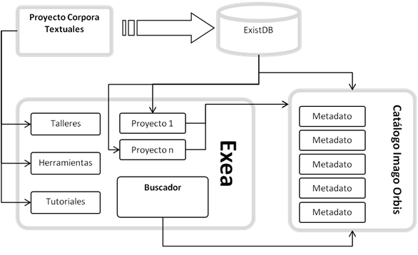
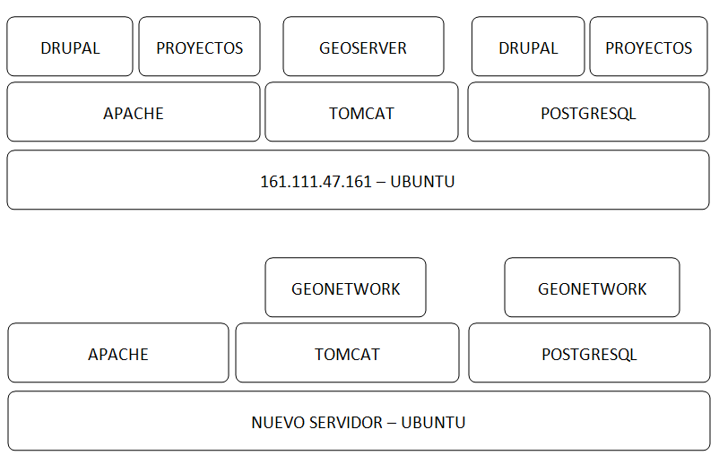
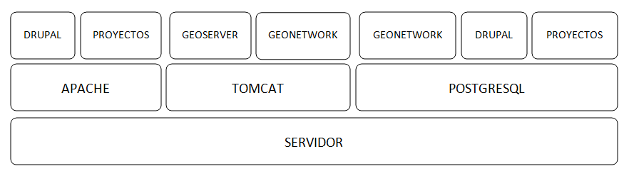

============================================================================================
CIENCIAS SOCIALES Y HUMANIDADES DIGITALES EN EL CCHS CAMBIADO Y RECAMBIADO Y REQUETECAMBIADO
============================================================================================

Desde la Unidad de SIG queremos favorecer la utilización de herramientas digitales y un marco de trabajo colaborativo en el seno del CCHS como elementos potenciadores de una investigación abierta y multidisciplinar. Queremos proponer este camino siendo conscientes de la situación actual de los proyectos que se desarrollan en este centro, de su gran potencialidad pero también de algunas limitaciones.

Es por ello que planteamos una aproximación realista que ofrezca una solución directa a muchos de los problemas actualmente planteados y, al mismo tiempo, una vía de desarrollo a la que se puedan sumar nuevas iniciativas. Los portales web de Imago Orbis y Exea serán la vía de acceso a todo el trabajo que se desarrolle en este entorno, la generación de un marco de trabajo y conocimiento abierto y colaborativo el objetivo principal que nos planteamos.

IMAGO ORBIS
===========
El punto de entrada a la IDE de Humanidades y Ciencias Sociales (Imago Orbis) es el catálogo de metadatos de Geonetwork,  a partir de él se accede a los tres servicios web considerados como básicos, servicio de visualización, de catálogo y de nomenclátor. ¿Servicio de Descargas?

Se aprovecha la funcionalidad y el diseño de Geonetwork que cataloga e indexa los metadatos de recursos geográficos como núcleo de Imago.

ESTRUCTURA
----------
CONTENIDO DE LA PÁGINA PRINCIPAL
********************************
-	Un espacio para la búsqueda (sencilla)
- Búsquedas preconfiguradas para el acceso directo (INSPIRE, servicios de visualización).

			Búsquedas por temas / categorías.
-	Un par de pestañas de contenidos destacados (el que tiene más visitas y los últimos recursos publicados)
-	Acceso a búsquedas complejas de metadatos
-	Acceso directo al visualizador de Imago Orbis.
-	Acceso a registrarse.
-	Idioma
-	Redes Sociales

PÁGINA DE BÚSQUEDAS COMPLEJAS
*****************************
-	Configurar las búsquedas federadas
-	Búsquedas sobre los metadatos
-	Tipo de recurso
-	Acciones disponibles
-	Tipo de recurso
-	Temas
-	Temas INSPIRE
-	Palabras clave
-	Contacto para el recurso
-	Años
-	Formatos…..
-	Tipos de representación
-	Frecuencia de representación
-	Frecuencia de actualización
-	Estado
-	Tipo de servicio
-	Escala
-	Resolución

ELEMENTOS
----------
FUNCIONALIDAD EN EL MAPA
*****************************
El mapa interactivo está basado en Open Layers 3 y proporciona acceso a servicios OGC y otros estándares KML y OWS. Una vez conectados al catálogo  los usuarios pueden fácilmente encontrar nuevos servicios,capas para combinarlos.

-	Conexión con **Geoserver**.

http://apps.titellus.net/geoserver/ows?SERVICE=WMS&

-	Cargar capas de diferentes dominios.

https://www.geocat.net/es/mixed-content-and-cross-domain-errors-in-browser-sdi/
https://stackoverflow.com/questions/22363192/cors-tomcat-geoserver#25025579

-	Cargar más tipos de capas (GeoJSON, GML)
-	Llevarte el mapa a tu página con su contexto.
-	Identificar features de cualquier tipo de capa. (GetFeatureInfo para IDEARQ)

METADATOS
*********
-	ISO 19115/ISO 19119, según la codificación XML definida en ISO/TS19139
-	Perfil INSPIRE
-	Dublin Core
-	Extensible para soportar otros perfiles
-	Tres formas de integrar los metadatos:

      1. Edición de metadatos basada en plantillas.
      2. Importar a partir de un XML válido local o una URL
      3. Pegar directamente el XML.

-	Integrar en un flujo de trabajo que obligue a su validación e informe de su estado.
-	Elaborar un manual detallado sobre el funcionamiento de la edición basada en plantillas (en `Sphinx <http://www.sphinx-doc.org/>`_) .

FEEDBACK
********
-	Puntuación de metadatos.
-	Posibilidad de recibir correos con comentarios

SERVICIO DE DESCARGAS (ATOM)
****************************
Integrar un servicio de descargas conforme con INSPIRE

CATÁLOGOS
*********
- Catálogos virtuales,  por proyecto / categoría,  que añaden la capacidad de aplicar criterios extra a las peticiones al CSW.
- Definir un punto de entrada de INSPIRE CSW para devolver solo los metadatos relacionados con INSPIRE almacenados en el catálogo.
- Defina los puntos de entrada de CSW para devolver solo metadatos relacionados con temas específicos.

HARVESTING
**********
-	Geonetwork permite trabajar con datos descentralizados procedentes de diversos repositorios o harvesting. La información de los diferentes nodos o repositorios descentralizados se sincroniza cada cierto tiempo contra la base de datos de Geonetwok, actualizándose así los cambios sobre en nodo central del sistema.
-	La prueba de Harvesting funciona, pero en principio parece razonable utilizar las búsquedas federadas mientras se trabaje con nodos centralizados.
-	Los usuarios no pueden modificar los registros recolectados pero pueden duplicarlos.

GESTIÓN DE USUARIOS
*******************
GeoNetwork trabaja con cuatro tipos de usuarios:
-	Usuario registrado
-	Editor
-	Reviewer
-	Usuario administrador
-	Administrador

Los roles se pueden definir por grupo
- Gestión de usuarios y grupos almacenados en la BD
- Seguridad y control con LDAP (LDAP existente? ¿LDAP propio?)
- ¿Autorregistro?

OPEN DATA, LINKED DATA: DCAT
****************************
Actualmente GeoNetwork posee algunos puntos de entrada para opendata en formato rdf, sin embargo, estas interfaces no están conectadas aún con la interfaz gráfica.
http://161.111.72.7:8080/geonetwork/srv/sp/portal.opensearch
http://161.111.72.7:8080/geonetwork/srv/sp/rdf.search?any
http://161.111.72.7:8080/geonetwork/srv/eng/portal.sitemap?format=rdf

Haciendo esta petición se obtiene el listado de todos los recursos existentes en el catálogo.
El acceso con SPARQL se hace en principio a través de virtuoso.

https://www.geocat.net/es/query-geonetwork-with-sparql/
https://ies-svn.jrc.ec.europa.eu/projects/metadata/wiki/Alignment_of_INSPIRE_metadata_with_DCAT-AP

TESAUROS
********
-	Incorporados en la personalización.

    GEMET / EUROVOC / UNESCO /INSPIRE/ (otros…)

-	Posibilidad de incorporar parte de los Tesauros de GETTY.

OTROS
*****
-	Posibilidad de enlazar recursos
-	Crear Vocabularios propios
-	Personalización del entorno. Diseño
-	Usabilidad – ISO /IEC 916-1 (mapa web)
-	Accesibilidad mínimo AA (accesibilidad normal o media)
-	Condiciones de uso de los recursos.
-	Rendimiento.
-	INSPIRE exige un tiempo de respuesta entre 3-5 segundos

ARQUITECTURA
************
**Sistema operativo:** Ubuntu.

**Base de datos:** postgreSQL.

**Contenedor de aplicaciones y servidor web:** se despliega sobre un contenedor de aplicaciones java, tomcatT funcionando sobre el framework spring.

**Apache Lucene**: La funcionalidad de GeoNetwork , es la de buscar en información tipo texto keywords, titles... se trata de textos que están almacenados en la base de datos y que deben poder ser buscados desde GeoNetwork. Para realizar esto hace uso de Apache Lucene. Apache Lucene es un buscador de texto. Podremos configurar Lucene con los campos en los que queramos que nos realice la búsqueda. Para ello deberemos modificar los campos en el archivo "*config-lucene.xml*".

Z39.50  es un protocolo cliente-servidor dirigido a facilitar la búsqueda y recuperación de información en distintos sistemas a través de una misma interfaz. Su aplicación en el mundo de las bibliotecas y de los centros de documentación permite la consulta de recursos distribuidos en distintas bases de datos, desde un mismo punto de acceso.”  GeoNetwork usando el protocolo Z39.50 puede acceder a catálogos remotos y hace que sus datos estén disponibles para otros servicios de catálogo”.

GENERACIÓN DE INFORMES
**********************
Los administradores pueden generar diversos informes  para evaluar la utilización de la plataforma:
-	Metadatos Actualizados
-	Metadatos internos
-	Cargas de fichero de metadatos
-	Descargas de ficheros de metadatos
-	Acceso de usuarios

DOCUMENTACIÓN
*************
Elaborar la documentación de Geonetwork en `Sphinx <http://www.sphinx-doc.org/>`_.

REFERENCIAS
*************
- https://geonetwork-opensource.org/manuals/2.10.4/eng/users/admin/authentication/index.html#ldap
- https://github.com/geonetwork/core-geonetwork/pull/1900#discussion_r117707971
- http://www.sphinx-doc.org/en/master/
- https://github.com/geonetwork/doc/tree/6f072c42083837d88d6950dae5f629838b6f720c/en/tutorials
- https://geonetwork-opensource.org/manuals/3.4.x/es/administrator-guide/configuring-the-catalog/system-configuration.html
- https://ies-svn.jrc.ec.europa.eu/projects/metadata/wiki/Alignment_of_INSPIRE_metadata_with_DCAT-AP
 
EXEA
====
Punto de acceso a todos los recursos de Ciencias Sociales y Humanidades Digitales, proyectos, exposiciones, herramientas, actividades… Basado en Drupal.
Es posible consultar una pequeña maqueta aquí: https://app.moqups.com/cffreire/ll3U1sPNm5/view.

**OBJETIVO**: Generar una comunidad de investigadores de todo tipo (científicos, contratados, técnicos, becarios, personal de otras instituciones…) que colabore en dos líneas de desarrollo principales:

-	Explotar datos: estructurar nuestros datos de forma que sean explotables y reutilizables, generar visualizaciones que mejoren su comprensión…
-	Abrir datos: explorar la forma de generar un entorno de datos abiertos respetuoso con el trabajo de todos y que permita integrar libremente datos de diferentes orígenes.

**ROLES:**

-	No autenticado.
-	Externo: De otras instituciones.
-	CCHS: Personal CCHS.
-	Moderador: Comisión.
-	Administrador: USIG.
-	User 1: Creador.

**ÁREAS:**

1.	Repositorio de recursos: tres bloques: no geo, geo y destacados (los nodos) / dos bloques: recursos - destacados.
2.	Proyectos-Exea: Páginas de proyectos. Sólo rol CCHS.
3.	Exposiciones: Realizadas con los recursos disponibles sobre un tema concreto. Rol biblioteca¿?.
4.	Herramientas para las HD: rol Externo y CCHS.
5.	Actividades: talleres, debates, charlas… rol Externo y CCHS.
6.	Tutoriales: de Exea (rol CCHS); de herramientas y aplicaciones (rol Externo y CCHS).
7.	Comentarios: Rol anónimo. Cualquiera puede comentar los contenidos en los que los comentarios se habiliten.

**FUNCIONAMIENTO:** Los propios usuarios generan contenido, un moderador puede aprobar su contenido. Hay varios casos:

-	Área 1: generada por nosotros mediante algoritmos de conexión a geonetwork y plantilla de presentación de datos
-	Área 2: Habría que establecer una estrategia conjunta con la biblioteca, que es la que tiene contenido apto para realizar exposiciones. Se requeriría la utilización de un software específico como Omeka (open source) y debatir la forma de integrarlo en Drupal, quizás mediante enlaces a las colecciones generadas
-	Área 3: requiere la preparación de plantillas y tutoriales para que los investigadores puedan trabajar en ella
-	Áreas 4, 5 y 6: Estilo foro, cualquiera puede publicar contenido, directamente o mediante moderación

 
PUNTOS COMUNES
--------------
Ambos proyectos comparten una serie de requisitos, tareas y una misma filosofía de trabajo:

REPARTO DE TAREAS
*****************

USIG
++++
-	Infraestructura tecnológica de ambas cosas.
-	Imago Orbis completo: gestión, mantenimiento y contenido.
-	Catálogo de Exea.
- Administración de Exea: generación de la página y de formularios necesarios.
-	Tutoriales de nuestras herramientas.
-	Talleres de Información Geográfica.
-	Carga de contenido en Exea relacionado con nuestros proyectos

Investigadores (comisión)
+++++++++++++++++++++++++
-	Dinamización de las Humanidades Digitales y Ciencias Sociales.
-	Carga de contenido en Exea de: proyectos, herramientas, actividades.
-	Metadatado (Dublin Core) de los recursos generados.
-	Fomentar un marco de trabajo de datos abiertos.

Biblioteca
+++++++++++
-	Gestión en abierto de sus recursos.
-	Creación de exposiciones.
-	Enlace a las exposiciones desde Exea.

CREACIÓN DE UNA NUEVA HERRAMIENTA DIGITAL
*****************************************
El desarrollo de nuevas herramientas o servicios útiles para las HD irá sumando partes a la estructura general de Exea / Imago Orbis, siguiendo un esquema similar al del ejemplo de los Corpora Textuales que se muestra en el diagrama:

ARQUITECTURA INFORMÁTICA USIG NECESARIA
****************************************
**OPCIÓN 1: servidores estáticos**

**OPCIÓN 2: hosting escalable**

DESARROLLO COLABORATIVO
***********************
El desarrollo de software necesario para la generación de ambas estructuras se realizará en abierto, a través de la plataforma **GITHUB**, espacio de trabajo común (repositorio). GitHub es un servidor Git de uso público y gratuito, en el que se desarrollan de forma colaborativa proyectos de software libre.
Planteamos una adaptación a este entorno de trabajo en dos sentidos:
-	Creación y mantenimiento de los desarrollos y configuraciones personalizadas de Geonetwork (y potencialmente Exea, si es que se realiza algún desarrollo propio)
-	Creación de repositorios para los desarrollos concretos de herramientas que puedan formar parte de Exea

CUESTIONES
***********
DRUPAL es una plataforma segura. Nos puede servir para alojar nuestros php de carga de datos?

Imago Orbis es más pesado en principio pero más fácil de dimensionar. Exea necesitaría una arquitectura escalable (a lo mejor es suficiente instalar un ubuntu con HDD en LVM/ZFS)

Podemos contratar al diseñador de Antonio Lafuente. Otra opción sería la Unidad de Actividades Científicas, pero seguro que no mola tanto el resultado.
Hay que tener un servidor de desarrollo y otro de producción con DRUPAL

Deberíamos pensar también en abrirlo a más gente, para permitir una comunidad más activa y para que personal externo de proyectos pueda introducir datos, si al final hacemos interfaces de carga

El área de proyectos-exea siempre va a sernos útil, si el resto del proyecto languidece, siempre podremos usarla para hacer nuestras paginitas

Comisión de investigadores: Incluir algún becario y técnico. Que debatan sobre la estructura de las áreas (excepto la primera) y sobre la dinamización de las HD en el centro. Que decida quién va a moderar el contenido. Nosotros nos comprometemos a hacer nuestra parte: mantener la infraestructura y generar contenido en nuestra área de trabajo: talleres, tutoriales, etc.

Portátil USIG: si vamos a hacer tutoriales y cosas así, hay que comprar un pepino y ponerle Ubuntu

¿Sería posible realizar exposiciones sobre el material digitalizado de la TNT?

En un año Drupal dejará de soportar PHP5 hay que pasarse al 7+
